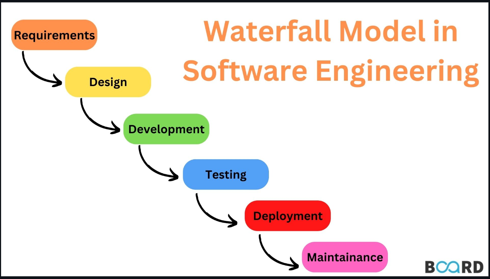
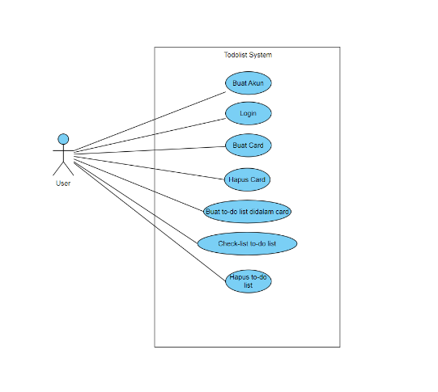

# **Tugas-KPPL-Week-7**

## **Anggota Kelompok**

- Adyuta Prajahita Murdianto (5025221186)
  
- Alendra Rafif Athaillah (5025221297)
  
- Muhammad Hafidz Harridil Mahali (5025221030)

**Kelas:** KPPL E

**Soal:** Buatlah  Studi Kasus Pembuatan Aplikasi dengan menggunakan Metode Waterfall atau Agile Develepment,

## **Metode Waterfall**

Metode Waterfall adalah salah satu model pengembangan perangkat lunak yang digunakan secara luas dalam rekayasa perangkat lunak. Metode ini merupakan salah satu pendekatan tertua dan paling tradisional, yang beroperasi berdasarkan pendekatan sekuensial atau linier. Dalam metode Waterfall, setiap fase dalam proses pengembangan perangkat lunak dilakukan secara berurutan, di mana satu fase harus diselesaikan sebelum fase berikutnya dimulai. Ini memberikan struktur yang jelas dan terorganisir dengan baik.

## **Latar Belakang**

Seorang petinggi perusahaan multinasional memiliki keluhan serius terkait dengan produktivitas karyawannya. Ia mengamati bahwa sebagian besar karyawan yang bekerja di perusahaannya kesulitan dalam mengatur waktu dan tugas mereka, sehingga berdampak pada rendahnya efisiensi kerja. Setelah melakukan beberapa evaluasi dan diskusi internal, ia menyimpulkan bahwa kurangnya sistem yang terorganisir menjadi salah satu penyebab utama. Petinggi tersebut pun memutuskan untuk mencari solusi yang dapat membantu karyawan dalam mengelola pekerjaan mereka dengan lebih baik. Sebagai langkah awal, ia menghubungi Software House Gebang, sebuah perusahaan pengembang perangkat lunak yang terkenal dengan inovasi-inovasi aplikasinya, untuk meminta bantuan dalam pembuatan sebuah aplikasi todo-list yang dapat membantu setiap karyawan dalam menyusun dan mengatur alur pekerjaan secara lebih terstruktur, efektif, dan efisien. Harapannya, dengan adanya aplikasi ini, setiap pekerja bisa lebih fokus dan terarah dalam menjalankan tugas-tugas mereka, sehingga produktivitas perusahaan secara keseluruhan akan meningkat.

## **Requirement Analysis**

Pada tahapan ini, kita akan menganalisa kebutuhan dari pengguna aplikasi sesuai dengan keinginan dari petinggi perusahaan tersebut. Kebutuhan aplikasi antara lain,

- User dapat membuat akun.

- User dapat melakukan login ke dalam akun yang sudah dibuat.

- User dapat membuat card untuk menyimpan to-do list.

- User dapat menghapus card yang sudah dibuat.

- User dapat membuat beberapa to-do list di dalam card.

- User dapat melakukan Check-list pada to do list yang telah dibuat.

- User dapat menghapus to-do list yang telah dibuat.

## **Design**

Pada bagian ini, kita akan membuat use case diagram untuk aplikasi yang akan dibuat, berikut use case diagram yang telah dibuat,

## **Development**

Aplikasi dibangun menggunakan single page design pattern. Backend atau server dibangun menggunakan teknologi express-js dan untuk frontend menggunakan react-js.

## **Testing**

Pada bagian ini, kita akan melakukan testing terhadap aplikasi yang telah kita buat. Berikut adalah hasilnya,

- User berhasil membuat akun dan login ke dalam akun tersebut.

- User berhasil membuat card.

- User berhasil membuat to do list di dalam card tersebut.

- User berhasil check-list to do list yang sudah dibuat.

- User berhasil menghapus to-do list yang telah dibuat.

- User berhasil menghapus card yang dibuat.

## **Deployment**

Aplikasi yang telah dibangun akan di deploy di lingkungan jaringan perusahaan. Hal ini berguna agar aplikasi hanya dapat diakses oleh setiap pekerja di perusahaan tersebut.

## **Maintenance**

Setelah tahap deployment, kami perlu memantau dan memelihara aplikasi agar bisa berjalan dengan baik. Dimana mencakup hal berikut,

- Pemantauan kinerja aplikasi untuk mencegah masalah seperti bottleneck.

- Pemantauan bug dan masalah pengguna yang tidak terdeteksi ketika tahap testing.

- Pembaharuan keamanan jika terdapat celah keamanan baru.

